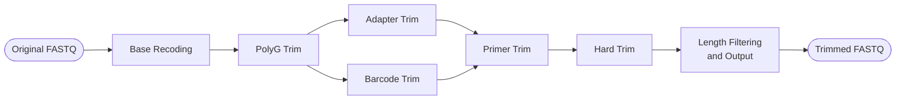

# IRMA-core "Trimmer" README

## Motivation and Goals

With Next Generation Sequencing (NGS) available on different platforms, having a portable, efficient, and customizable tool for quality control is important. FASTQ quality control can involve multiple tools and I/O operations with intermediate data left behind that may not get cleaned up.

Consider a FASTQ file provided by an Illumina NGS pipeline. It may be necessary to find and trim adapters, remove primers, and perhaps also hard trim bases. This stand-alone IRMA-core process can achieve the necessary cleanup in a single pass:


## Order of Operations

IRMA-core's trimmer process allows for multiple trimming operations to be performed on each sequence. These operations follow a set order, based on the position in which the artifacts to be trimmed are expected to occur within the sequence.



Every step in the process is optional, but if multiple operations are selected, the above chart shows the order in which trimming operations will proceed. Note that `Adapter Trim` and `Barcode Trim` are *mutually exclusive*, since [adapters](https://support-docs.illumina.com/SHARE/AdapterSequences/Content/SHARE/AdapterSeq/Overview.htm) are associated with Illumina sequencing while more error-prone [barcodes](https://nanoporetech.com/document/chemistry-technical-document) might be needed for Oxford Nanopore Technologies sequencing.

### Example Chained Command

The following will perform poly-g trimming, followed by barcode trimming, primer trimming, and then hard trimming on every sequence in the FASTQ file.

```bash
irma-core trimmer input.fastq \
    --fastq-output-file trimmed.fastq \
    --polyg-trim 10 \
    --barcode-trim CACAAAGACACCGACAACTTTCTT \
    --primer-trim primers.fasta --p-kmer-length 17 \
    --hard-trim 10
```

Details about each trimming operation and their arguments are given below.

## Paired Reads

Some sequencers (including Illumina sequencers) generate reads from both ends of the DNA fragments, resulting in two FASTQ files of paired reads. To handle these, you can optionally include a second FASTQ file as *input*. For paired read *output*, you can include two output files, or if only a single output file is provided, the paired reads will be interleaved.

### Widowed or Orphaned Reads

When handling paired reads, a widowed (or orphaned) read may occur,  where one of the reads was filtered and leaves the second one behind. If it is desired to not include widowed reads in the output, IRMA-core will inspect the headers of paired reads to ensure the reads match. If this option is selected and one paired read is filtered due to post-trimming length filtering, the widowed read will not be included in the output.

It is important to note that if the `--filter-widows` flag is selected, the input FASTQ files are assumed to contain reads in the same order. Therefore, if non-matching headers are found while reading through the paired inputs, the program will terminate early with an error message.

### Arguments

| Parameter         | Default | Kind | Description                                                           |
| ----------------- | ------- | ---- | --------------------------------------------------------------------- |
| `--filter-widows` |         |      | Flag enabling filtering of paired reads if a read is missing its mate |

## Base Recoding

By default, bases in the input FASTQ files are recoded into uppercase canonical bases (`ACGTN`). Gaps, ambiguous IUPAC bases, and non-IUPAC characters are automatically changed to `N`. This behavior can be disabled with the `--preserve-fastq` flag.

### Arguments

| Parameter          | Default | Kind | Description                                               |
| ------------------ | ------- | ---- | --------------------------------------------------------- |
| `--preserve-fastq` |         |      | Flag disabling uppercase canonical base recoding of input |

## Poly-G Trim

[Poly-G Artifacts](https://speciationgenomics.github.io/fastp/) appear as a series of multiple consecutive high-confidence G bases at the end of Illumina reads sequenced close to the end of the sequencing process. For these to be trimmed, the user must specify the threshold number of consecutive `G` bases. If the sequence does have at least that many `G` bases at the end, the trimmer will continue matching until it finds a non-`G` base, then will trim all consecutive `G`s from the end of the sequence.

### Arguments

| Parameter                 | Default | Kind      | Description                                                                               |
| ------------------------- | ------- | --------- | ----------------------------------------------------------------------------------------- |
| **`--polyg-trim` (`-G`)** |         | ≥ 1       | The threshold number of consecutive `G` bases to be matched for poly-G trimming to occur. |
| `--g-polyg-end`           | b       | [l, r, b] | The end(s) of the sequence that polyg-trim should occur on.                               |
| `--g-polyg-left`          |         | ≥ 1       | Overrides `--polyg-trim` for the left end of the sequence.                                |
| `--g-polyg-right`         |         | ≥ 1       | Overrides `--polyg-trim` for the right end of the sequence.                               |

### Example Command

The following checks if the first 10 bases on the left end of each sequence are `G`, then continue to attempt to match further consecutive `G`'s and trim all. Then performs the same for the right ends of the sequences.

```bash
irma-core trimmer input.fastq \
    --polyg-trim 10 --g-polyg-end b
```

## Adapter Trim

Some high-throughput sequencing processes, such as those developed by Illumina, use [adapters](https://support-docs.illumina.com/SHARE/AdapterSequences/Content/SHARE/AdapterSeq/Overview.htm) to allow DNA fragments to bind to the flow cell where the sequencing reaction occurs. The `adapter-trim` subprocess uses a string search starting from the left end to search the sequence for the provided adapter, and starts at the right end of each sequence searching for the adapter's **reverse complement**.

### Arguments

| Parameter                   | Default | Kind    | Description                                                                                                        |
| --------------------------- | ------- | ------- | ------------------------------------------------------------------------------------------------------------------ |
| **`--adapter-trim` (`-A`)** |         | String  | A literal nucleotide sequence for the adapter to be trimmed. Non-canonical (ACGTN) characters will cause an error. |
| `--a-fuzzy`                 | False   | Boolean | Allows one mismatch (hamming distance 1) when matching adapters.                                                   |

### Example Command

The following will attempt to match the provided adapter sequence, with up to one mismatch, at the left end of each read and the reverse complement of the adapter sequence at the right end of each read. If either is found, the adapter and any bases before it (or after for right end trimming) will be trimmed.

```bash
irma-core trimmer input.fastq \
    --adapter-trim CTGTCTCTTATACACATCT --a-fuzzy
```

## Barcode Trim

In Oxford Nanopore Technologies' sequencing workflow, short DNA sequences or [barcodes](https://nanoporetech.com/document/chemistry-technical-document) are appended for demultiplexing, but possibly may not be removed. The `barcode-trim` subprocess uses a fuzzy string search, which can be a full scan of the sequence, or constrained to the ends of the sequence, to locate and trim barcodes. If the option `--b-end b` (both) or `--b-end r` (right) is selected, IRMA-core will automatically compute the **reverse complement** of the provided barcode for searching and trimming on the right end.

### Arguments

| Parameter                   | Default   | Kind    | Description                                                                                                                                                             |
| --------------------------- | --------- | ------- | ----------------------------------------------------------------------------------------------------------------------------------------------------------------------- |
| **`--barcode-trim` (`-B`)** |           | String  | A literal nucleotide sequence for the barcode to be trimmed. Non-canonical (ACGTN) characters will cause an error.                                                      |
| `--b-end`                   | b         | l, r, b | The end(s) of the sequence that barcode trimming should occur on. If `b` or `r` is selected, the reverse complement of the provided barcode will be computed and used for right-end barcode trimming.                                                                                                      |
| `--b-restrict`              | full scan | ≥ 1     | Window size for barcode trimming on both ends of the sequence. If no size is provided, the trimmer will perform a full-scan barcode search, checking the full sequence. |
| `--b-restrict-left`         |           | ≥ 1     | Overrides `--b-restrict` for the left end.                                                                                                                              |
| `--b-restrict-right`        |           | ≥ 1     | Overrides `--b-restrict` for the right end.                                                                                                                             |
| `--b-hdist`                 | 0         | [0-3]   | Number of allowed mismatches for barcode matching and trimming.                                                                                                         |

### Example Command

The following will attempt to match the provided barcode sequence, allowing 2 mismatches, in the leftmost 30 bases of the sequence. If found, the barcode and any bases before it will be trimmed. The same process will be repeated for the reverse complement of the barcode on the right end of the sequence.

```bash
irma-core trimmer input.fastq \
    --barcode-trim CACAAAGACACCGACAACTTTCTT --b-restrict 30 --b-hdist 2
```

## Primer Trim

[Primers](https://www.cd-genomics.com/resource-sequencing-primers.html) provide a starting point for DNA synthesis during the Polymerase Chain Reaction proccess. They are designed to bind to specific sites in the sample and are annealed to the ends of the sequence. The `primer-trim` subprocess uses a kmer-based approach to match a kmer set generated from a provided FASTA file of primers to a DNA sequence. The farthest inward matched primer kmer will be trimmed along with all bases before it (or after for right end trimming).

### Arguments

| Parameter                  | Default | Kind      | Description                                                                        |
| -------------------------- | ------- | --------- | ---------------------------------------------------------------------------------- |
| **`--primer-trim` (`-P`)** |         | Filepath  | A path to the primer FASTA file.                                                   |
| `--p-kmer-length`          |         | [2-21]    | Size of the kmers created from the primer FASTA file for matching in the sequence. |
| `--p-fuzzy`                | False   | Boolean   | Allows one mismatch when matching primer kmers.                                    |
| `--p-end`                  | b       | [l, r, b] | The end(s) of the sequence that primer trimming should occur on.                   |
| `--p-restrict`             | 30      | ≥ 1       | Restriction window size for primer trimming on both ends of the sequence.          |
| `--p-restrict-left`        |         | ≥ 1       | Overrides `--p-restrict` for the left end.                                         |
| `--p-restrict-right`       |         | ≥ 1       | Overrides `--p-restrict` for the right end.                                        |

### Example Command

The following will build a set of every 17-mer within the primer fasta, along with each possible one-mismatch 17-mer. Then IRMA-core will attempt to match these to 17-mers within the first 30 bases on the left of each sequence, and last 30 bases on the right, and will trim the 17-mer if found along with all bases before it (or after for right end trimming).

```bash
irma-core trimmer input.fastq \
    --primer-trim primers.fasta --p-kmer-length 17 --p-fuzzy --p-restrict 30 --p-restrict-right 35
```

## Hard Trim

Trims a specified number of bases on one or both ends of the sequence. If `hard-trim` would trim more bases than the length of a sequence in the input, that sequence will be excluded from the output.

### Arguments

| Parameter            | Kind | Description                                              |
| -------------------- | ---- | -------------------------------------------------------- |
| `--hard-trim` (`-H`) | ≥ 1  | Hard trim from each end the specified number of bases.   |
| `--h-left`           | ≥ 1  | Standalone or overrides `--hard-trim` for the left end.  |
| `--h-right`          | ≥ 1  | Standalone or overrides `--hard-trim` for the right end. |

### Example Command

The following will take the input sequences and remove the first 15 and last 20 bases from each sequence.

```bash
irma-core trimmer input.fastq \
    --hard-trim 15 --h-right 20
```

## Length Filtering and Output

### Arguments

| Parameter                       | Default  | Kind              | Description                                                                                                                          |
| ------------------------------- | -------- | ----------------- | ------------------------------------------------------------------------------------------------------------------------------------ |
| `--min-length` (`-n`)           | 1        | ≥ 1               | Sequences shorter than this length, post-trimming, will be filtered from output.                                                     |
| `--fastq-output` (`-1` or `-o`) | `STDOUT` | Filepath          | Path to the output file for trimmed FASTQ. If not provided, the output will print to STDOUT.                                         |
| `--fastq-output2` (`-2`)        | `None`   | Optional Filepath | Optional path to secondary output file for paired FASTQ. If this argument is omitted, output is interleaved.                         |
| `--mask` (`-m`)                 | False    | Boolean           | Rather than trimming matched bases, they can instead be masked to the letter `N`. This flag is applied to *all* trimming operations. |
